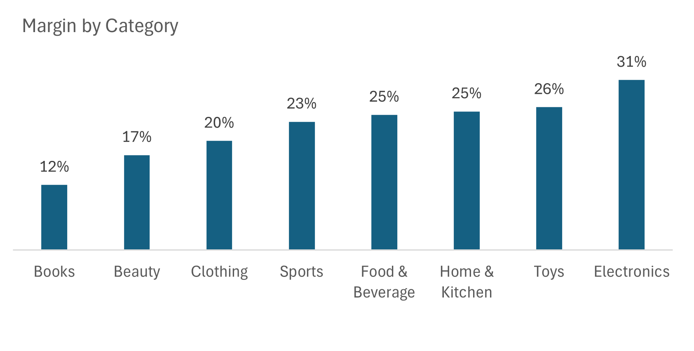
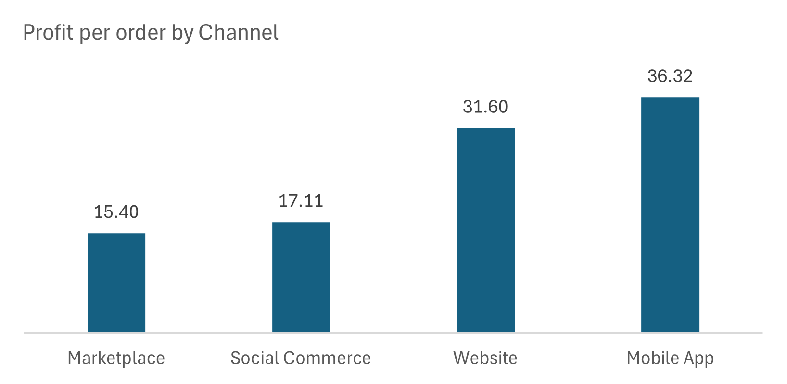
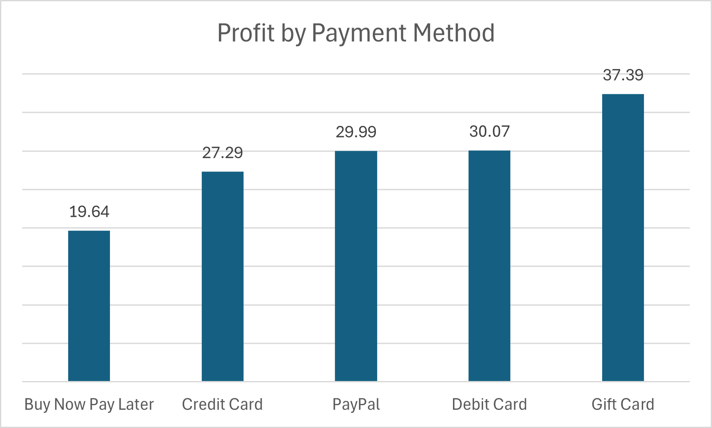
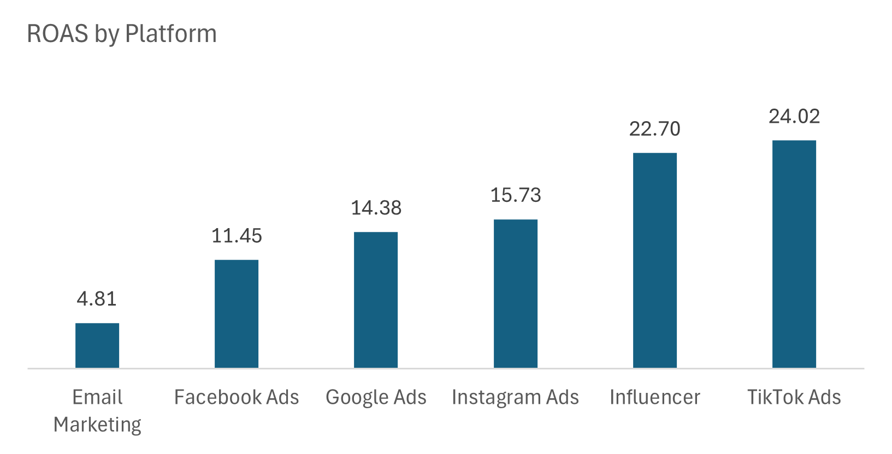
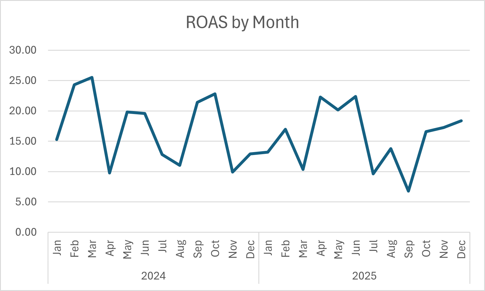
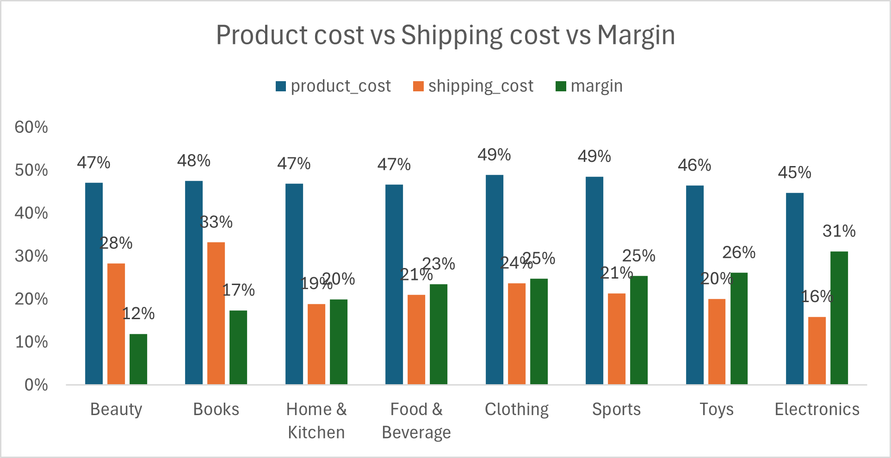
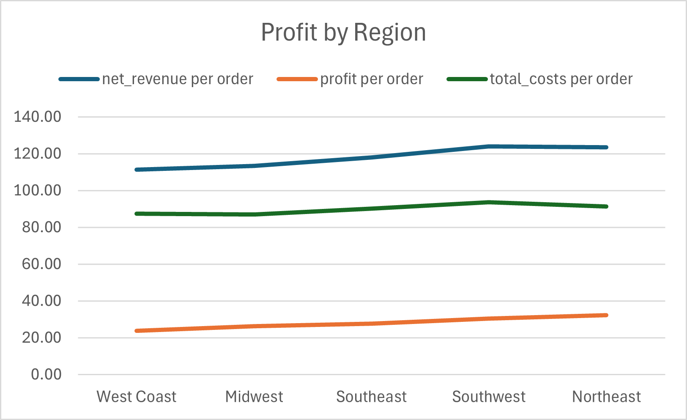
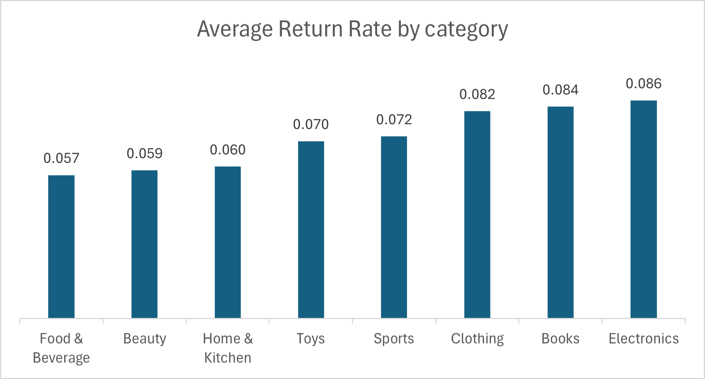
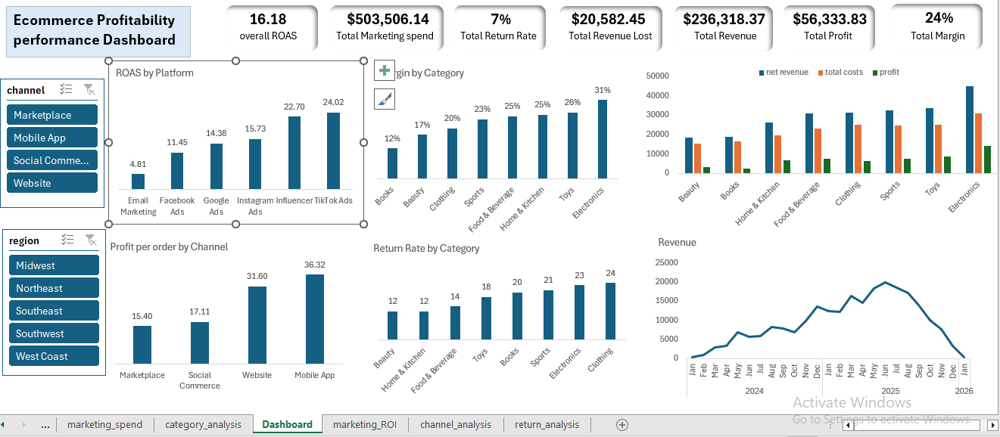

<h3 align="center">⭐ End-to-End Data Analytics Project</h3>
<h1 align="center">📊 ECOMMERCE PROFITABILILY ANALYSIS</h1>

**Project Title:** Ecommerce Profitability Analysis Report

**Prepared by:** Farheen Muqadam

**Date:** 25-05-2026
 
---

## 1. Executive Summary  

- **Objective:** Evaluate BrightCart’s profitability across product categories, sales channels, returns, and marketing performance to identify margin leakage and optimize spend efficiency.
- **Overall Profit Margin:** Overall profit margin stands at 24% with total revenue of $236K and profit of $56k .
- **Key Finding 1 (Category Profitability):**
 - Most profitable category: Electronics (31% margin) despite highest return rate (~8.6%)
 -	Least profitable category: Books (12% margin) due to high product cost (~48%) and shipping (~33%). 
- **Key Finding 2 (Channel Performance):**
 -	Mobile App ($36.3 avg profit/order) and Website ($31.6) are the most profitable channels. Marketplace ($15.4) is the least profitable.
 -	Social Commerce has highest return rate (~9.1%), reducing profitability.
- **Key Finding 3 (Returns Impact):**
 -	Overall return rate:  7.2%
 -	Total revenue lost to returns: $20,582
 -	Highest return categories: Electronics (8.6%), Books (8.4%), Clothing (8.2%)
- **Key Finding 4 (Marketing Efficiency):**
 -	Overall ROAS  16.1 
 -	Top platforms: TikTok Ads ( 24 ROAS), Influencer (22.7), Instagram (15.7)
 -	Lowest: Email Marketing (4.8 ROAS)
 -	Weak months identified: Apr 2024 (9.7), Nov 2024 (9.9), Mar 2025 (10.3), Sep 2025 (6.7)  
- **Business Impact:**
  -	 $20K revenue lost due to returns
  -	Low-performing categories and channels dragging margins
  -	Inefficient marketing spend concentrated in specific months/platforms
 
- **Recommendation:**
  - Reduce spend in low-ROAS platform and months to eliminate inefficiency
  -	Shift focus to Website & Mobile App (highest profit per order)
  - Optimize cost-heavy categories (Books, Clothing) by reducing shipping/product costs
  - Reduce high-return categories impact (Electronics, Clothing) through better product targeting

 --- 
## 2. Problem Statement

BrightCart has generated over $1M in gross revenue over the past two years, yet the company is experiencing declining net profit margins. This indicates that while sales performance is strong, underlying cost structures and operational inefficiencies are impacting overall profitability.
The key business challenge is to identify where profits are being lost across:
-	Product categories (cost vs margin differences)
-	Sales channels (platform fees and efficiency)
-	Marketing investments (return on ad spend)
-	Product returns (revenue leakage)
Understanding these drivers is critical because:
-	Declining margins directly affect business sustainability and growth
-	Inefficient marketing spend reduces return on investment
-	High return rates and cost-heavy categories erode true profitability
This analysis aims to provide data-driven insights to help the CEO make informed decisions on:
-	Optimizing product and pricing strategy
-	Improving channel performance
-	Reducing waste in marketing spend
-	Minimizing the financial impact of returns

 --- 
## 3. Data Overview
- **Data Source(s):** Order-level transactions, Product catalog (cost data), Marketing spend data
- **Time Period:** 2024- 2025
- **Dataset Size:** order (2000 rows -20 columns), Marketing (144 rows- 10 columns)

**Key Variables:**
- net_revenue
-	profit
-	total_cost
-	product_cost
-	shipping_cost
-	platform_fee
-	refund_amount
-	channel
-	Primary_category
-	returned
-	spend
-	impression
-	clicks
-	cpc
-	cpa
-	roas

---

## 4. Data Preparation
- **Duplicates removed:** Yes
- **Feature engineering:**
  - return flag(0,1)
  
- **Tools used:**
  - Excel (Pivot tables, charts, calculated fields, formulas)
  
---

## 5. Exploratory Data Analysis (EDA)
### 5.1 Overall Trends
-  Overall profit Margin: 24%
-  Revenue is decreasing significantly in recent months
-  Profit margins vary significantly across categories and channels
-  Marketing efficiency fluctuates by month

### 5.3 Distribution Analysis
- Returns are unevenly distributed, with higher return rates in Electronics, Books, and Social Commerce, contributing to localized margin pressure.
-	Cost structure varies significantly across categories, especially product and shipping costs (up to ~49% and ~33%), making it the primary driver of profitability differences.
-	Marketing efficiency shows high variability, with ROAS ranging widely across platforms and months, indicating inconsistent performance and opportunities to optimize spend.

---

## 6. Key Insights
### Insight 1: Category Profitability variation
- **Observation:** profit margins vary widely across categories. Electronics is the most profitable category with profit margin (31%) despite having the highest return rate (8.6%), while Books is the least profitable category (12% margin) driven by high product cost (48%) and shipping cost (33%) and moderate return rate
- **Evidence:** electronics (31%) vs Books (12%)
  
  
  
- **Business Meaning:** Profitability differences are primarily driven by cost structure (product + shipping) rather than returns alone

### Insight 2: Owned channels are more profitable
- **Observation:** Mobile App ($36.3 avg profit/order) and Website ($31.6) are the most profitable channels, Social Commerce ($17.1) and Marketplace ($15.4) generate significantly lower profit per order.
- **Evidence:** Mobile App ($36.3 ) vs Marketplace ($15.4)
  
  
  
- **Business Meaning:** Owned channels (Website & App) outperform third-party platforms due to lower platform fees and better customer quality, while external channels suffer from higher costs and returns.

### Insight 3: Payment method shows variation in profitability
- **Observation:** Gift Cards ($37.4 profit) and Debit Cards ($30.1) generate higher profitability. Buy Now Pay Later ($19.6) has the lowest profitability, likely due to associated financing or processing costs.
- **Evidence:** gift card ($37.4) vs buy now pay later ($19.6)
  
  
  
- **Business Meaning:** Payment methods with additional financial or processing costs reduce overall margins.

### Insight 4: Marketing Performance is uneven across platforms and TIme
- **Observation:** ROAS varies significantly across platforms and months. Overall roas (16)
- **Evidence:** tiktok ads ($24.02) has highest ROAS compared to email Marketing($4.8). Sep, Mar, Jul 2025, Nov, Aug, Apr 2024 are the least performing months as per chart
  
  

  
  
- **Business Meaning:** Marketing is effective but contains inefficiency and budget can be optimized without impacting high performing periods.

---

## 7. Key Metrics &amp; KPIs

| Metric | Value | Explanation |
|------------------|--------|--------------------------------|
| Total Margin | 24% | Net margin rate |
| Total Profit | $56,333.83 | Overall profit rate |
| Total Revenue | $236,318.37 | Net Revenue |
| Total Revenue Lost | $20,582.45 | Revenue lost to returned orders |
| Total Return Rate | 7% | Total rate of returned orders |
| Total Marketing Spend | $503,506.14 | Total money spent on marketing |
| Overall ROAS | 16.18 | Return on ad spend |

## 8. Visualizations

- **Chart 1:** High-cost drive low margin in certain categories

  
  
- **Chart 2:** as per the chart Northeast ($32.3) profit and Southwest ($30.3) are the most profitable regions. West Coast ($23.9) shows the lowest profitability.

- **Chart 3:** Return rates range from 5.7% to 8.6% , Electronics (8.6%) have higher return rate as compared to Food & Beverages (5.6%)

  
  

## 9. Dashboard overview

---

## 9. Recommendations

### Recommendation 1: Optimized Marketing Spend (Cut Inefficient Periods & Platform)
- **Action:**
  - 	Cut Email Marketing (ROAS 4.8) Platform
  - 	Cut Facebook Ads (ROAS 11) Platform spending by 8.5%
  - 	Cut low-ROAS months (Mar 2025 ~10.37, Jul 2025 ~9.64, Sep 2025 ~6.77) spend by 30%

- **Expected Impact:**
  - 	Cutting Email Marketing platform saves $24,461.3 with minimal revenue impact
  - 	Cutting spending on Facebook Ads by 8.5% & low performing Month by 30% will save in total 20% of the Annual Marketing Spend.

### Recommendation 2: Shift Focus to High Margin Categories
- **Action:**
  - 	Increase promotion and inventory focus on high margin categories like Electronics (31%), Toy (26%)
  - 	Reduce emphasis on Books (12%) unless cost structure is optimized
- **Expected Impact:**
  - 	Improve overall profit margin 

### Recommendation 3: Reduce Cost in Low-Margin Categories
- **Action:**
  - 	Optimize cost heavy categories especially Books.
  - 	Negotiate supplier pricing 
  - 	Reduce shipping / Logistics costs

- **Expected Impact:**
  - 	Even 5-10% cost reduction will lead to 3-5% margin improvement 
  - 	It can increase books margin from 12% to 15-18%.

### Recommendation 4: Reduce Return in High-Impact Categories
- **Action:**
  - 	Target high -return categories Electronics & clothing..
  - 	Improve product description especially for clothing & improve customer targeting and quality control

- **Expected Impact:**
  - 	Reduce return rate from 8.2% - 7% of high return category
  - 	Improve margins without increasing sales

---

## 10. Limitations

- Data limitations: No customer-level behavior data 
- Assumptions made: Returns fully eliminate revenue
- Potential biases: Marketing attribution may not be fully accurate

